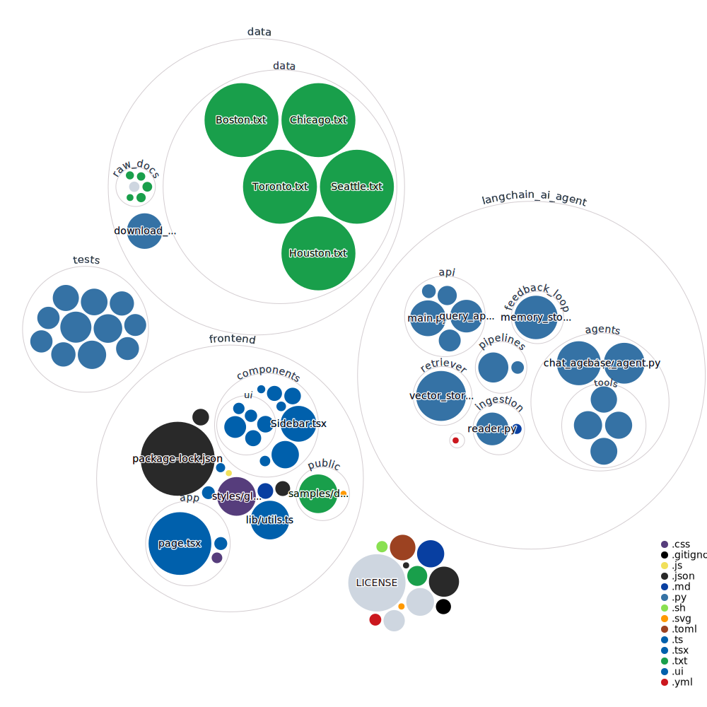

## LangChain AI Agent — Your Smart Assistant 🚀

Hey there! This project is my own **AI agent** powered by LangChain. It's built to help with:

- 🧠 Classifying text and routing it to the right logic
- 📚 Adding files to a searchable knowledge base
- 🤖 Asking questions and getting answers from what I’ve uploaded

No rocket science — just upload stuff, click buttons, and the agent does the rest.

---




### 🔍 What can it do?

#### 1. Classify
If I upload a doc or paste some text, it figures out what it's about — like:
- “Is this support-related?”
- “Should I extract questions from this?”

Then it calls the right tool automatically. Simple.

---

#### 2. Ingest Knowledge
If I want to teach the system something (like feeding it docs), I just:
- Switch to **Ingest mode**
- Upload my files
- It breaks them into chunks and stores them smartly (FAISS)

Now I can query those chunks later. Boom.

---

#### 3. Ask Questions (Query)
Once I’ve ingested stuff, I can:
- Ask it a question in normal language
- It finds the most relevant chunks
- Then gives me a smart answer (RAG-style)

---

### 🖥️ What’s in the UI?

- Upload files (multi-file supported)
- Toggle between Classify and Ingest mode
- Run pipelines
- Ask questions from my ingested data
- View full results and even export them

---

### 🛠️ How I run it

#### Backend (FastAPI)
```bash
cd langchain_ai_agent
uvicorn langchain_ai_agent.api.main:app --reload
```

#### Frontend (Next.js)
```bash
cd frontend
npm install
npm run dev
```

---

### 🧠 Tech I'm using

- LangChain + tools
- Sentence Transformers (MiniLM)
- FAISS vector store
- Unstructured for parsing docs
- FastAPI for serving
- Next.js + Tailwind for the frontend
- Gemini model from Vertex AI

---

### 🪜 What I’ll do next

I will next:
- Add RAG-style chat flow (so it answers naturally, not just chunks)
- Add support for namespaces (multi-project KBs)
- Maybe connect to Google Drive or Slack

---

Let me know if you want a CLI version, Docker setup, or even a public demo URL.  
This is my AI sidekick — just getting started 💪